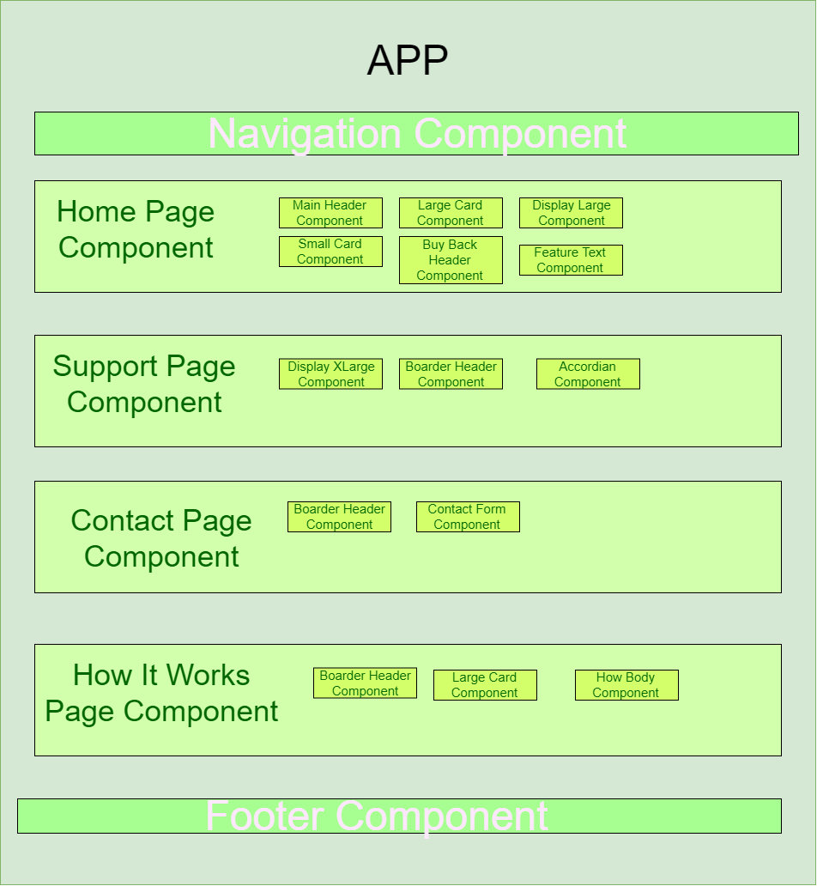

[](https://gitpod.io/#https://github.com/pimp-my-book/goa-landing-page) 

# GOA Landing Page

## Setup Instrustions 

Once you've cloned this repo, install the dependaices

```
$ yarn install

```

Then you can start the app and navigate to localhost:

```
$ yarn serve

```


## How is this app structured?

Component Diagram:



## Developed with:

* [VueJS](http://vuejs.org)
* [TailwindCSS](https://tailwindcss.com/docs/what-is-tailwind/)
